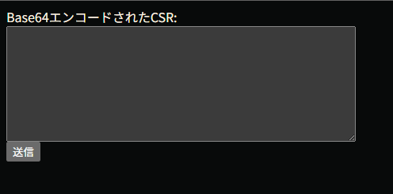
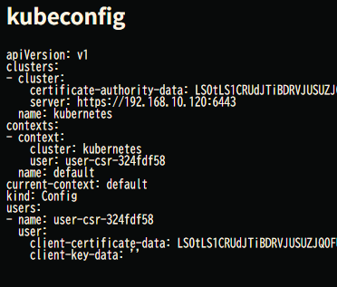

# テスト方法

## CSR作成

同ディレクトリ内にあるtest-key-gen.shにより秘密鍵とCSRの生成を実施。

```
$ bash test-key-gen.sh # test.csr.b64が生成される
```

## CSR送信

このtest.csr.b64の内容をmain.pyを実行して表示できるフォームに入力する。



送信するとkubernetesクラスタ上にCSRリソースが作成される。

## kubeconfig発行

管理者がkubernetesクラスタ上に作成されたCSRリソースを確認しapproveするとwebフォームが切り替わって発行されたkubeconfigが表示される。

CSR approve (管理者のみ実施可能)

```
$ kubectl certificate approve ${CSR名}
```

approveするとkubeconfigページに切り替わる



client-key-dataには秘密鍵をbase64でエンコードした文字列を入れ込むこと。